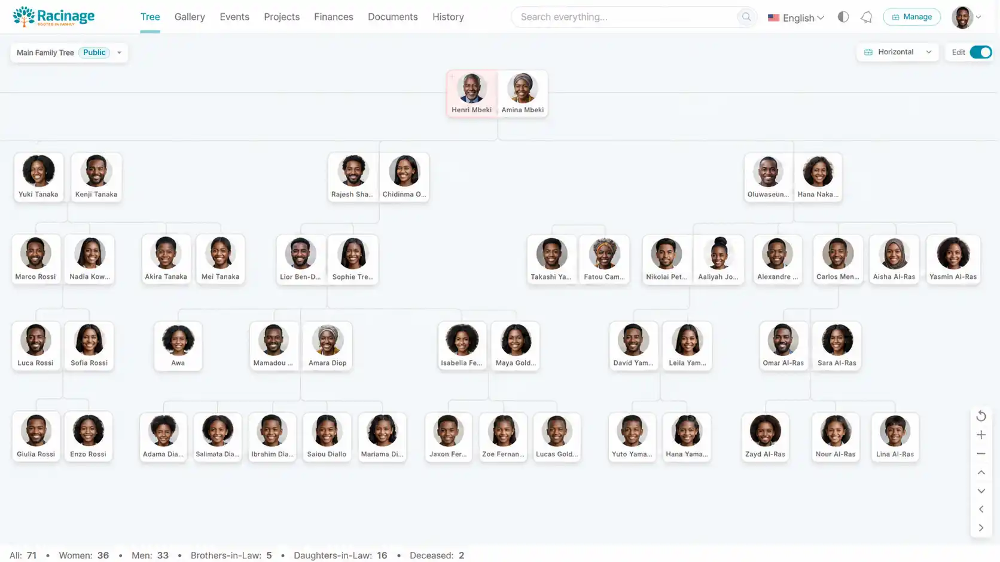

# Racinage Free

Racinage Free is the open-source Windows portable edition of Racinage for the Lite Free plan. It runs locally on one Windows device, stores data under `%LOCALAPPDATA%\Racinage Free`, and does not connect to the hosted Racinage database.



## Download

- Latest bundled release: [`RacinageFree-v0.12.2.exe`](releases/desktop/racinage-free-v0.12.2/RacinageFree-v0.12.2.exe)
- Version: `racinage-free-v0.12.2`
- SHA-256: see [`checksums.txt`](releases/desktop/racinage-free-v0.12.2/checksums.txt)

## What Is Included

- Native C# WinForms/WebView2 host.
- Local loopback server and embedded SQLite storage.
- Single-file bootstrap executable with payload refresh.
- Racinage icon, screenshot, build script, release manifest, and checksums.

This repository intentionally does not include the hosted Racinage PHP/MySQL web app, production credentials, private uploads, or paid-plan server features.

## Build From Source

Requirements:

- Windows 10 or newer.
- .NET Framework C# compiler, usually available at `C:\Windows\Microsoft.NET\Framework64\v4.0.30319\csc.exe`.
- NuGet packages in the standard global package folder:
  - `Microsoft.Web.WebView2` `1.0.4022.49`
  - `SQLitePCLRaw.lib.e_sqlite3` `2.1.6`

Build:

```powershell
powershell -ExecutionPolicy Bypass -File desktop\RacinageFree\build\build-racinage-free.ps1
```

Output:

```text
releases\desktop\racinage-free-v0.12.2\RacinageFree-v0.12.2.exe
```

## Local Data

Racinage Free keeps mutable data outside the executable:

```text
%LOCALAPPDATA%\Racinage Free\data
%LOCALAPPDATA%\Racinage Free\media
%LOCALAPPDATA%\Racinage Free\logs
%LOCALAPPDATA%\Racinage Free\webview
```

Refreshing or rebuilding the same version preserves local data.

## Repository

Public repo: <https://github.com/Fallax-Vision/racinage_free>

Hosted Racinage and paid-plan features live at <https://racinage.com>.
