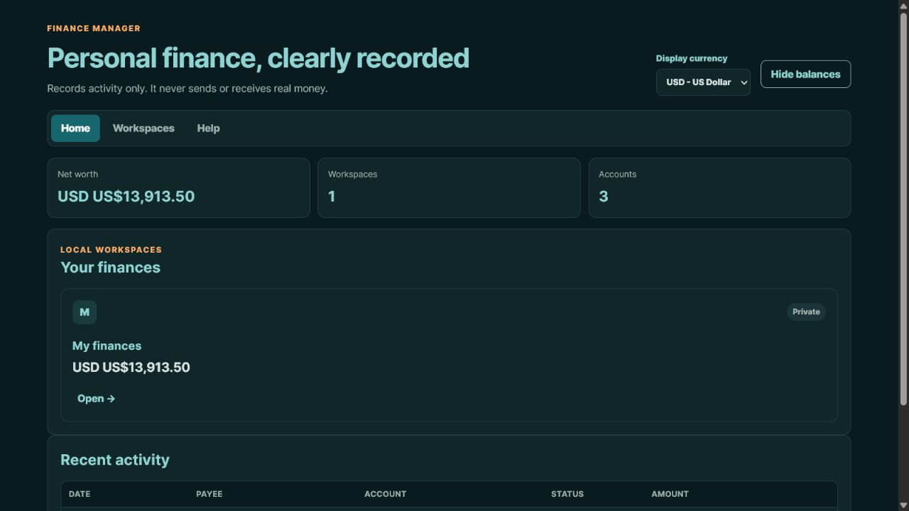
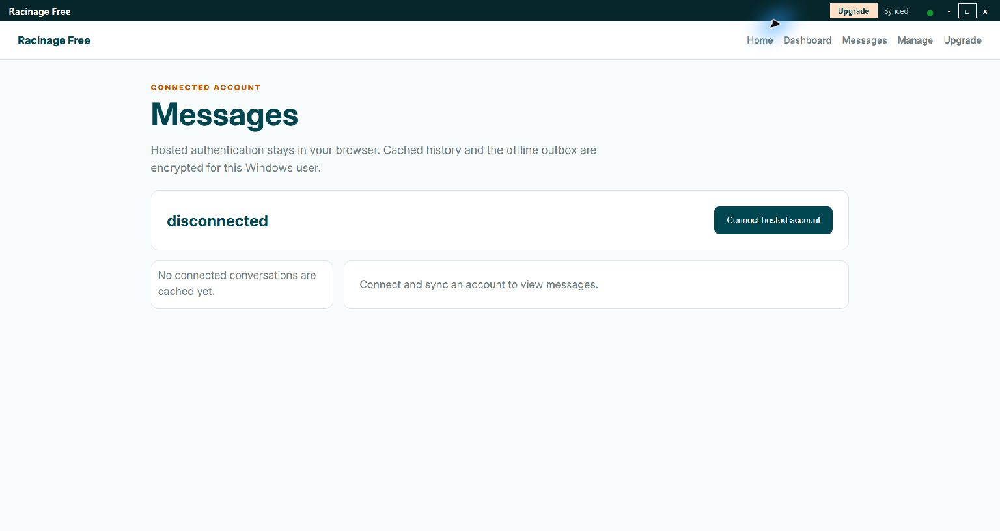

# Racinage Free

Racinage Free is the open-source Windows portable edition of Racinage for the Lite Free plan. It runs locally on one Windows device and stores family data under `%LOCALAPPDATA%\Racinage Free`. The optional Plugins tab connects only to the signed public Racinage plugin catalog and hosted purchase pages; it does not connect the local family database to the hosted Racinage database.

The source tree is now `v0.17.0`. It includes an optional local AI assistant for Ollama, LM Studio, and custom OpenAI-compatible loopback servers, plus opt-in connected messaging for a hosted Racinage account. The latest published, signed executable remains `v0.15.0` until the trusted Windows signing release gate is configured.






## Download

- Latest bundled release: [`RacinageFree-v0.15.0.exe`](releases/desktop/racinage-free-v0.15.0/RacinageFree-v0.15.0.exe)
- Version: `racinage-free-v0.15.0`
- SHA-256: see [`checksums.txt`](releases/desktop/racinage-free-v0.15.0/checksums.txt)

## What Is Included

- Borderless native C# WinForms/WebView2 host with one custom app bar.
- Local loopback server and embedded SQLite storage.
- Hosted-style Manage sections without collaboration controls.
- Optional hosted messaging connection through browser-based device authorization. Password and two-factor authentication are entered only on `racinage.com`.
- Windows DPAPI-protected hosted tokens, an encrypted local message cache, an encrypted ordered offline outbox, resumable file uploads, event-stream recovery, and explicit reconnect conflict reporting.
- First-class Ollama, LM Studio, and custom local OpenAI-compatible setup, model discovery, capability testing, streaming chat, and typed local change previews.
- Strict loopback-only AI endpoints with no cloud fallback. Optional local provider tokens are protected for the current Windows user with DPAPI.
- Preinstalled Finance Manager with offline workspaces, accounts, transactions, budgets, goals, debts, investments, forecasts, reports, circles, imports, exports, and private attachments.
- Installable completely free NameGen companion for parents, with a bundled offline name finder, custom names, favorites, personal ratings and notes, private groups, solo baby projects, and JSON import/export.
- User display currency and manually maintained offline currency rates.
- Bundled Inter variable fonts for consistent offline typography.
- Signed online catalog for reviewed local-compatible plugins, including monthly/yearly pricing and active hosted reductions, with checksum and archive-path verification.
- Sandboxed portable plugin pages with an asynchronous manifest-authorized local bridge and hosted links for optional Pro purchases and entitlements.
- Single-file bootstrap executable with payload refresh.
- Racinage icon, screenshot, build script, release manifest, and checksums.

This repository intentionally does not include the hosted Racinage PHP/MySQL web app, production credentials, private uploads, or paid-plan server features.

## Build From Source

Requirements:

- Windows 10 or newer.
- .NET Framework C# compiler, usually available at `C:\Windows\Microsoft.NET\Framework64\v4.0.30319\csc.exe`.
- NuGet packages in the standard global package folder:
  - `Microsoft.Web.WebView2` `1.0.4022.49`
  - `SQLitePCLRaw.lib.e_sqlite3` `2.1.6`

Build:

```powershell
powershell -ExecutionPolicy Bypass -File desktop\RacinageFree\build\build-racinage-free.ps1 -Development
```

Output:

```text
desktop\RacinageFree\dist\development\RacinageFree-v0.17.0-dev.exe
```

Development builds are intentionally unsigned and are not release artifacts. Public `v0.17.0` builds require the protected `RACINAGE_WINDOWS_SIGNTOOL` plus a signing certificate path or thumbprint; the build verifies signatures on both the native host and bootstrapper.

## Local Data

Racinage Free keeps mutable data outside the executable:

```text
%LOCALAPPDATA%\Racinage Free\data
%LOCALAPPDATA%\Racinage Free\media
%LOCALAPPDATA%\Racinage Free\logs
%LOCALAPPDATA%\Racinage Free\webview
%LOCALAPPDATA%\Racinage Free\plugins
%LOCALAPPDATA%\Racinage Free\plugin-cache
%LOCALAPPDATA%\Racinage Free\ai
%LOCALAPPDATA%\Racinage Free\connected
```

Refreshing or rebuilding the same version preserves local data. Portable AI never synchronizes or exposes the local SQLite database to hosted Racinage. Connected messaging synchronizes only the hosted conversations and files authorized for the connected account; it never uploads the local family database.

## Repository

Public repo: <https://github.com/Fallax-Vision/racinage_free>

Hosted Racinage and paid-plan features live at <https://racinage.com>.
