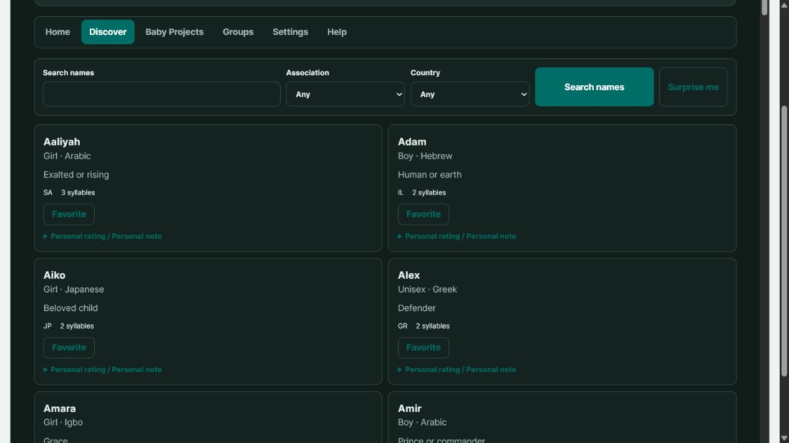

# Racinage Free 0.15.0

This release adds the asynchronous reviewed local-plugin lifecycle and manifest-authorized local bridge needed by the completely free NameGen companion. NameGen can be installed from the local plugin library and used offline for name discovery, custom names, favorites, personal ratings and notes, private groups, solo baby projects, and import/export.

Hosted community, moderation, public social statistics, manager tools, and partner collaboration are intentionally excluded from the offline companion. Existing Finance Manager behavior and local records remain supported.

The shell header is now identified by `#header`; install, enable, disable, uninstall, and plugin bridge operations do not replace it.

